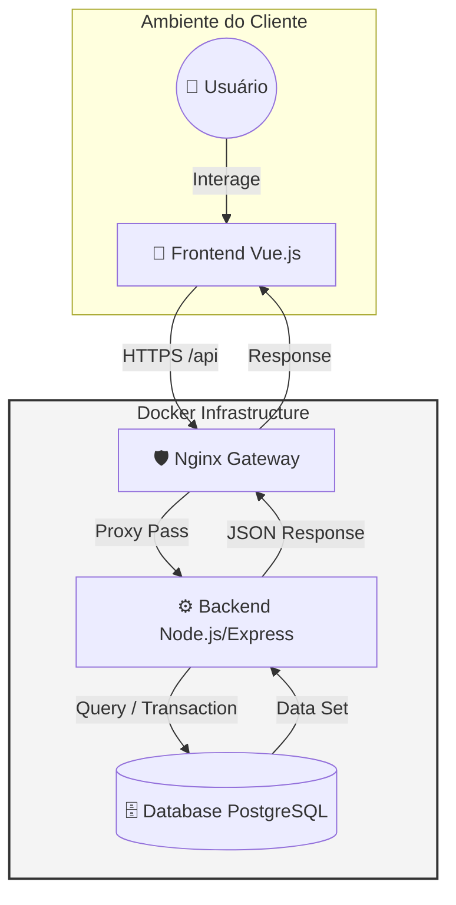

# 🎟️ Sistema de Sorteios

  

> **Plataforma completa para gestão, venda e realização de rifas online de alta performance.**

Este projeto é um Monorepo unificando Frontend e Backend em um ambiente containerizado, focado em escalabilidade, segurança e experiência de desenvolvimento (DX).

---

## 🏗️ Arquitetura e Fluxo de Dados

Abaixo, a topologia da aplicação. O tráfego da API é gerenciado pelo Nginx (Reverse Proxy), garantindo segurança e balanceamento entre o cliente Vue.js e o servidor Node.js.

⚡ Tecnologias

O projeto utiliza uma stack moderna e robusta:

Vue 3 - Framework reativo com Composition API.

Node.js - Runtime JavaScript de alta performance.

Express - Framework web minimalista para APIs.

PostgreSQL - Banco de dados relacional robusto.

Docker - Containerização e orquestração de ambiente.

🚀 Como Rodar em 3 Passos (Quickstart)

Siga este guia para ter o sistema rodando localmente em menos de 5 minutos.

1. Clonar o Repositório
   Baixe o código fonte para sua máquina.
   git clone [https://github.com/sua-org/sistema-sorteios.git](https://github.com/sua-org/sistema-sorteios.git)
   cd sistema-sorteios

2. Configurar Ambiente (.env)
   Duplique o arquivo de exemplo para definir as variáveis de ambiente (DB, Portas, Secrets).

# Linux / Mac

cp .env.example .env

# Windows (Powershell)

copy .env.example .env

3. Subir com Docker
   Inicie todos os serviços (Banco, API e Frontend) com um único comando.
   docker-compose up --build -d

   Pronto! O sistema estará acessível em:

Frontend: http://localhost:8080

API: http://localhost:3000

Docs (Swagger): http://localhost:3000/docs

📂 Estrutura do Projeto

sistema-sorteios/
├── backend/ # API, Models, Services e Configs
├── frontend/ # Vue App, Components, Views
├── nginx/ # Configurações do Proxy Reverso
├── docker-compose.yml # Orquestração dos serviços
└── .env.example # Template de variáveis

📝 Documentação Adicional
Para detalhes específicos de implementação, consulte os arquivos README.md dentro de cada pasta:

backend/ # Documentação da API
frontend/ # Documentação do Frontend
