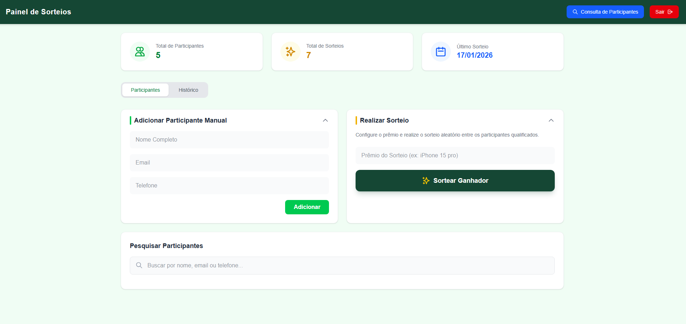
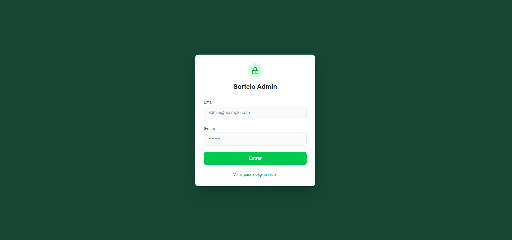

# Sistema de Sorteios

A robust full-stack application for managing and displaying raffles, featuring a modern public interface for participants and a comprehensive dashboard for administrators.

## 🚀 Features

### Public View

- **Raffle Listing**: Browsable gallery of active and completed raffles.
- **Winner Visualization**: Dedicated section to showcase raffle winners.
- **No User Accounts**: Streamlined experience for participants without the need for registration.

## 📸 Screenshots

|              Public Home              |                   Admin Dashboard                    |
| :-----------------------------------: | :--------------------------------------------------: |
|  |  |

<p align="center">
  
  <br>
  <em>Admin Login</em>
</p>

### Admin Dashboard (Restricted)

- **Raffle Management**: Full CRUD capabilities for creating and editing raffles.
- **Manual Draw (AdminDraw)**: Integrated tool to perform random draws for raffles.
- **Webhook Integration**: Support for external payment/status updates via Lastlink webhooks.
- **Secure Access**: Protected routes and authentication for administrative actions.

## 🛠 Tech Stack

### Frontend

- **Framework**: Vue 3 (Composition API)
- **Styling**: Tailwind CSS
- **Build Tool**: Vite
- **State Management**: Pinia (implied)

### Backend

- **Runtime**: Node.js
- **Framework**: Express.js
- **Database**: PostgreSQL
- **ORM/Query**: `pg` (node-postgres)

### Infrastructure

- **Containerization**: Docker & Docker Compose

## 📦 Getting Started

### Prerequisites

- [Git](https://git-scm.com/)
- [Docker](https://www.docker.com/) & Docker Compose

### Installation

1. **Clone the repository**

   ```bash
   git clone https://github.com/Joao-Assis1/sistema-sorteios.git
   cd sistema-sorteios
   ```

2. **Environment Setup**
   The project is configured to run out-of-the-box with Docker.
   - Check `docker-compose.yml` for default database credentials.
   - Ensure port `3000` (API), `5173` (Frontend), and `5433` (Database) are free.

3. **Run with Docker**
   Build and start the containers:

   ```bash
   docker-compose up --build
   ```

4. **Access the Application**
   - **Frontend (Public)**: [http://localhost:5173](http://localhost:5173)
   - **Admin Login**: [http://localhost:5173/admin/login](http://localhost:5173/admin/login)
   - **API Documentation**: [http://localhost:3000](http://localhost:3000)

## 📂 Project Structure

```
sistema-sorteios/
├── backend/            # Node.js Express API
│   ├── src/
│   │   ├── controllers/
│   │   ├── services/
│   │   └── routes/
│   └── Dockerfile
├── frontend/           # Vue 3 Application
│   ├── sistema-sorteios-front/
│   │   ├── src/        # Views, Components, Assets
│   │   └── Dockerfile
├── database/           # SQL scripts and Init files
└── docker-compose.yml  # Container orchestration
```

## 🔌 Main API Endpoints

- **Auth**: `/auth/login`
- **Public**: `/public/raffles`, `/public/winners`
- **Admin**: `/api/raffles`, `/api/draw`, `/api/webhooks`
