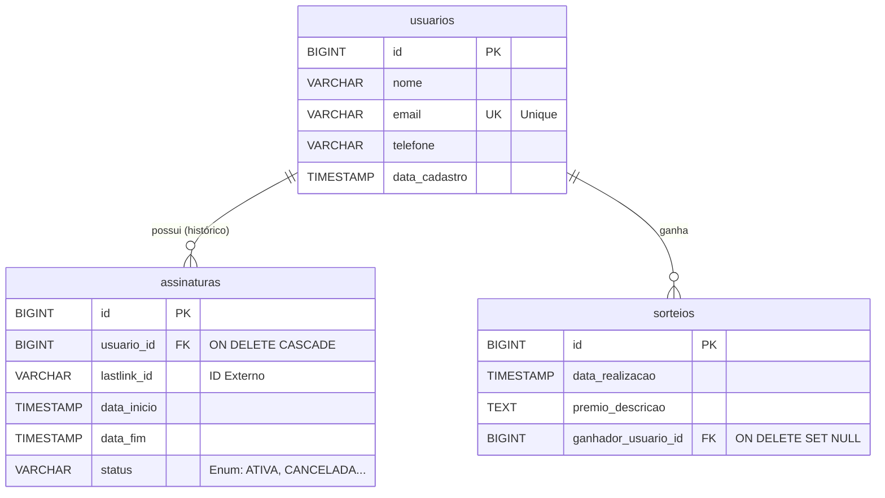

# 🗄️ Modelagem de Dados

> **Estrutura Relacional (PostgreSQL)**

Este documento detalha o esquema do banco de dados, dicionário de dados e as relações de integridade referencial. O modelo foi desenhado para suportar um **sistema baseado em assinaturas**, onde a validade da assinatura (`data_inicio` a `data_fim`) define a elegibilidade para os sorteios.

---

## 📐 Diagrama Entidade-Relacionamento (DER)

Abaixo, a representação visual das tabelas e como elas se conectam.

📚 Dicionário de Dados

1. Tabela usuarios
   Entidade central. Contém os dados cadastrais imutáveis de quem participa da plataforma.

   | Coluna          | Tipo           | Obrigatório | Descrição / Regra de Negócio                      |
   | :-------------- | :------------- | :---------: | :------------------------------------------------ |
   | **`id`**        | `BIGSERIAL`    |     Sim     | Identificador único (Chave Primária).             |
   | `nome`          | `VARCHAR(100)` |     Sim     | Nome completo para exibição no sorteio.           |
   | `email`         | `VARCHAR(150)` |     Sim     | **Unique Key**. Chave principal de contato/login. |
   | `telefone`      | `VARCHAR(20)`  |     Sim     | Contato secundário.                               |
   | `data_cadastro` | `TIMESTAMP`    |     Não     | Auditoria de entrada.                             |

2. Tabela assinaturas
   Core Business. Define a participação. Um usuário pode ter múltiplas assinaturas ao longo do tempo (histórico), mas o sistema valida a vigência atual.

   | Coluna        | Tipo          | Obrigatório | Descrição / Regra de Negócio            |
   | :------------ | :------------ | :---------: | :-------------------------------------- |
   | **`id`**      | `BIGSERIAL`   |     Sim     | Identificador da assinatura.            |
   | `usuario_id`  | `BIGINT`      |     Sim     | **FK**. Dono da assinatura.             |
   | `data_inicio` | `TIMESTAMP`   |     Sim     | Início da vigência.                     |
   | `data_fim`    | `TIMESTAMP`   |     Sim     | Fim da vigência (Validação do sorteio). |
   | `status`      | `VARCHAR(20)` |     Não     | Enum: `ATIVA`, `CANCELADA`, `VENCIDA`.  |

⚡ Performance Note: Existe um índice composto (idx_assinaturas_vigencia) nas colunas data_inicio, data_fim e status para acelerar a query de "Quem está participando do sorteio agora?".

3. Tabela sorteios
   Registro histórico dos eventos realizados e seus vencedores.

   | Coluna                | Tipo        | Obrigatório | Descrição / Regra de Negócio              |
   | :-------------------- | :---------- | :---------: | :---------------------------------------- |
   | **`id`**              | `BIGSERIAL` |     Sim     | Identificador do sorteio.                 |
   | `data_realizacao`     | `TIMESTAMP` |     Não     | Data da execução do script.               |
   | `premio_descricao`    | `TEXT`      |     Sim     | Item sorteado.                            |
   | `ganhador_usuario_id` | `BIGINT`    |     Não     | **FK**. Vencedor (NULL se user deletado). |

🔄 Comportamento de Delete (Integridade)

Para garantir a consistência dos dados, foram aplicadas as seguintes regras de exclusão:

Excluir Usuário:

As Assinaturas são excluídas automaticamente (CASCADE). Motivo: Sem usuário, não existe assinatura válida.

Os Sorteios são preservados, mas o campo ganhador fica vazio (SET NULL). Motivo: Precisamos provar que o sorteio ocorreu, mesmo que o usuário saia da base.
